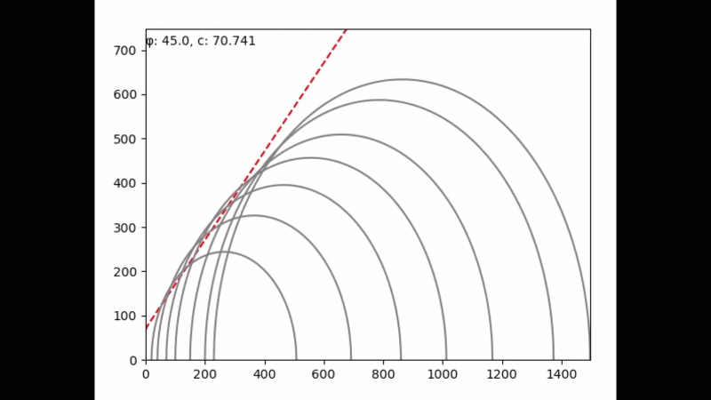
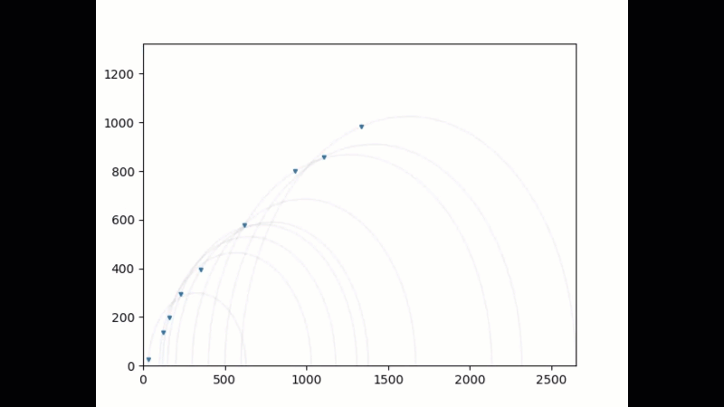

# Least Squares with Virtual Displacements (LSVD)

This program contains the algorithm of the LSVD method to calculate the shear strength paramaters of soils' samples.

To run the method you need to use the `LSVD` function and define your `s1` and `s3`.
* `LSVD(...)`
  
  **Parameters**

  * **s1** (_list_)- It is the failure stress of the soils samples, i.e., the deviatoric stress plus the confinement pressure.
  * **s3** (_list_)- It is the confinement pressure that the samples were subjected.
  * **typef** (_str_)- The type of failure envelope to calculate. Choose "linear" or "log".

## Example

The following pictures are examples of the LSVD method.

After running the method the shear failure envelope function is printed on the console.

  ```
  s3 = [50.9, 203.9, 407.8, 815.7, 917.7, 1019.7]     
  s1 = [1019.7, 1570.3, 2253.5, 3293.6, 3528.2, 3681.1]   
  ```
> Run `LSVD(s1, s3, typef= "log")`

The output is

```
τ= 921.327656270766  ln(σ + 749.6961834307052) + -6009.074646379983
```


